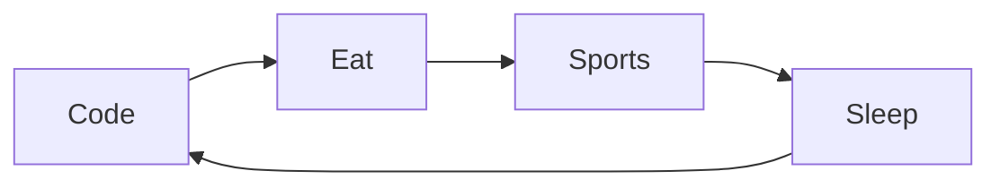
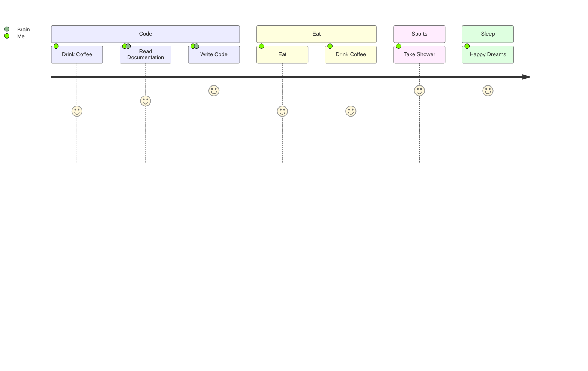

<!--
**samyrjob/samyrjob** is a ✨ _special_ ✨ repository because its `README.md` (this file) appears on your GitHub profile.

-->
# Samy Rjob

Hello! I'm Samy 👨‍💻, an experienced Full Stack Developer. Skilled in a broad range of languages such as Python 🐍, Java ⚡️☕️, Ruby 💎 and TypeScript. I design effective solutions with great efficiency 🚀. I'm driven to expand my expertise in building scalable, high-impact software solutions 📊. I introduce myself as a real tech spearhead to boost the growth of your business 💼. 

My work philosophy consists of three key points:

🤝 Collaboration | 🗂️ Organization | 💡 Creativity

 

## 🤝 Let's Connect

  
  

 
 

## 🔨 Languages and Tools:
  
  
  
  
  
  
  
  
  
  
  
  
  
  
  
    

 
 

## 📊 Github Stats

.

 
 

## 📌 Recent Activity 

<!--START_SECTION:activity-->
1. 🎉 Merged PR [#4](https://github.com/samyrjob/Automation_Applications/pull/4) in [samyrjob/Automation_Applications](https://github.com/samyrjob/Automation_Applications)
2. 💪 Opened PR [#4](https://github.com/samyrjob/Automation_Applications/pull/4) in [samyrjob/Automation_Applications](https://github.com/samyrjob/Automation_Applications)
3. 🎉 Merged PR [#3](https://github.com/samyrjob/Automation_Applications/pull/3) in [samyrjob/Automation_Applications](https://github.com/samyrjob/Automation_Applications)
4. 💪 Opened PR [#3](https://github.com/samyrjob/Automation_Applications/pull/3) in [samyrjob/Automation_Applications](https://github.com/samyrjob/Automation_Applications)
5. 🎉 Merged PR [#2](https://github.com/samyrjob/Automation_Applications/pull/2) in [samyrjob/Automation_Applications](https://github.com/samyrjob/Automation_Applications)
<!--END_SECTION:activity-->

 
 

## ⏳ My Daily Routine :

