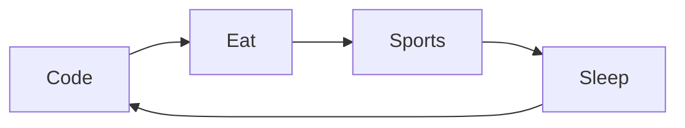
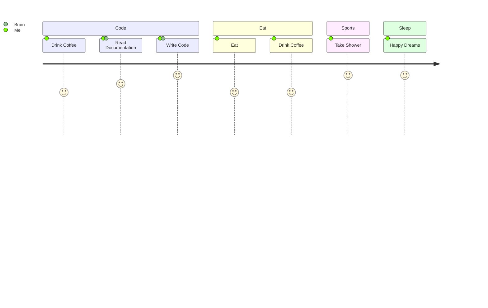

<!--
**samyrjob/samyrjob** is a ✨ _special_ ✨ repository because its `README.md` (this file) appears on your GitHub profile.

-->
# Samy Rjob

Hello! I'm Samy 👨‍💻 — a French software engineer based in Manchester. I build software that runs in production: backends, real-time systems and AI products.

## What I'm building

🎮 **[Futura](https://futura-game.com)** — a multiplayer virtual world I designed, built and operate solo. Java/Spring Boot backend, Angular front end, cryptographically signed desktop client in Go.

🤝 **[Elite Talents](https://elitetalents.fr/)** — Backend Engineer of a live recruitment platform. I built its 165-endpoint Next.js API, the Postgres schema and the security model (RLS on every table).

🤖 **[2YM Chatbot](https://uoc2ndyearbot.site/)** — a production RAG assistant used by real university cohorts for my MSc at the University of Chester. It answers in 9.4 seconds median, versus a two-day staff wait, and only when confident.

🛠️ **[Piskel MCP Server](https://github.com/samyrjob/piskel-mcp-server)** — open-source, LLM-drivable pixel-art engine with ~50 MCP tools.

## Stack

☕ Java · 🐹 Go · 📘 TypeScript · 🐍 Python · 💎 Ruby

Spring Boot · Next.js · PostgreSQL · Redis · Kafka · Docker · AWS

## Links

📁 [Portfolio](https://samyrjob.github.io/portfolio) · 💼 [LinkedIn](https://www.linkedin.com/in/samy-rjob-800315176/) · 📄 [CV](https://samyrjob.github.io/portfolio/Samy_Rjob_CV_UK.pdf)

 

## 🤝 Let's Connect

  
  

 
 

 

## 🔨 Languages and Tools:
  
  

  
  
  
  
  
  
  
  
  
  
  
  
  
  
    

 
 

## 📊 Github Stats

  

  

 

 
 

## 📌 Recent Activity 

<!--START_SECTION:activity-->
1. 🎉 Merged PR [#3](https://github.com/yafeiaa/piskel-mcp-server/pull/3) in [yafeiaa/piskel-mcp-server](https://github.com/yafeiaa/piskel-mcp-server)
2. 🗣 Commented on [#3](https://github.com/yafeiaa/piskel-mcp-server/pull/3#issuecomment-4281033598) in [yafeiaa/piskel-mcp-server](https://github.com/yafeiaa/piskel-mcp-server)
3. 🗣 Commented on [#3](https://github.com/yafeiaa/piskel-mcp-server/pull/3#issuecomment-4280992252) in [yafeiaa/piskel-mcp-server](https://github.com/yafeiaa/piskel-mcp-server)
4. 💪 Opened PR [#3](https://github.com/yafeiaa/piskel-mcp-server/pull/3) in [yafeiaa/piskel-mcp-server](https://github.com/yafeiaa/piskel-mcp-server)
5. ❗ Opened issue [#60](https://github.com/samyrjob/Futura/issues/60) in [samyrjob/Futura](https://github.com/samyrjob/Futura)
<!--END_SECTION:activity-->

 
 

## ⏳ My Daily Routine :

```mermaid


graph LR
    A[Code] --> B[Eat]
    B --> C[Sports]
    C --> D[Sleep]
    D --> A
```

```mermaid
journey
    
      section Code
      Drink Coffee: 5: Me
      Read Documentation: 6: Me,Brain
      Write Code: 7: Me,Brain
    section Eat
      Eat: 5: Me
      Drink Coffee: 5: Me
    section Sports
	    Take Shower: 7: Me
	  section Sleep
		  Happy Dreams: 7: Me
```
